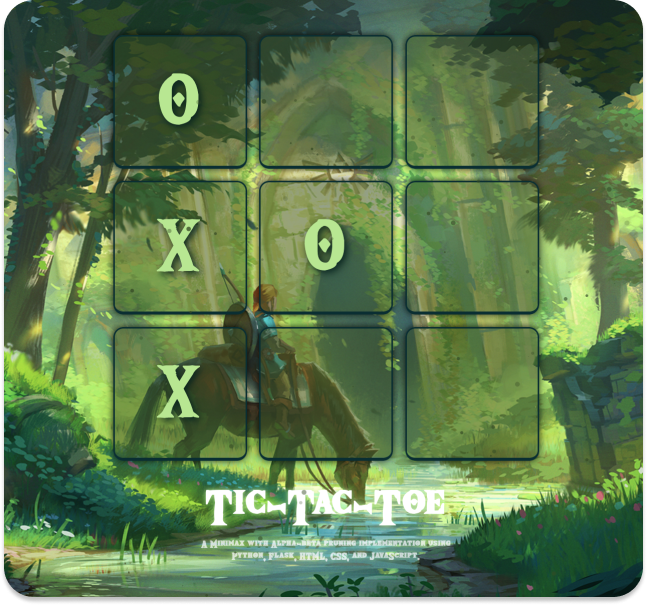

# Tic-Tac-Toe Zelda

  
  
A Tic-Tac-Toe game implementation in JavaScript using the Minimax algorithm for computer moves, along with Alpha-Beta Pruning optimization.

## Authors

* **[Yurixander Ricardo](https://github.com/yurixander)**
* **[Kenneth Nguyen](https://github.com/KennNguyen/)**
* **[Zee Fisher](https://github.com/zmfisher01)**

  <i>
    Please feel free to reach out to me on <a href="https://www.linkedin.com/in/yurixander/">LinkedIn</a> for business inquiries. 
    Images generated with DALL·E 3, and edited with Figma. 
    &copy; 2023 Yurixander Ricardo  
    
  </i>

